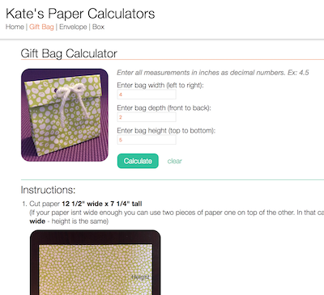

# Paper Calculators

A site with three different calculators for making stuff out of paper. One for gift bags, one for envelopes and one for little gift boxes. You input the dimensions you want your item to be and the calculator will spit out the dimensions to cut your paper to, where you need to put your folds and how to assemble.

See it live at [kates-paper-calculators.surge.sh](http://kates-paper-calculators.surge.sh/)

Pretty paper creations:  

Gift bag calculator page:  

## Background

I love making things out of paper. I have one of those [punch boards](http://www.wermemorykeepers.com/default.aspx?PageID=956&CategoryID=804&ProductID=15548&ItemID=17208&RootCatCode=08000) that makes folding envelopes and boxes a breeze - except no one seems to have proper directions for folding things to exact dimensions. So I reverse engineered some items, took measurements, built _proper_ formulas and built some programs to do the calculations for me.

## Coding Features

This used to live on my computer in a Ruby program that I launched with an alias from the terminal window, but I thought building it in React would be a great way to practice.

The components are split up between stateful container components and stateless functional components. In fact, there's only one stateful component in the whole app. All presentation stuff is handled by stateless components. All three calculators share the same presentational component with just a few different props passed down. With everything so neatly separated between function and presentation I am able to reuse almost everything for all calculators. This meant when I added a second calculator it took all of three minutes to set up the whole structure for it - all I really had to do was write the function to calculate the math.

I'm using Sass for this so I also built myself an automated bash script that handles installing and setting up Sass the way I like it.

## To do:

I built this entire site in one day. It's very functional, there are just a couple things I want to fix/improve:

* ~~Pull presentation JSX out of calculator methods~~
  * ~~I didn't realize the instructions would get so long. Want to return the variables in an object and send them to the individual components as props so they can render their own instructions.~~
* ~~Images~~
  * ~~I'm going to take pictures of the steps and the final product to put online.~~
* ~~Change calculations so they come out as fractions~~
  * ~~The program I wrote on my computer rounds calculations to the nearest 1/6th" and displays the number as a fraction (so instead of 8.44 you get 8 7/16). This is helpful because it's easier for me to find 8 7/16ths on a ruler than try to calculate in my head where 8.44 would be. Anyway, I just have to rewrite that functionality in JavaScript.~~
* Fix it so refresh doesn't break site
  * I'm using React Router to mimic a multi-page site and refreshing the page on a subpage breaks it. I'll figure out how to fix this soon but it's not on the top of my priority list right now.
